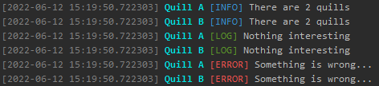
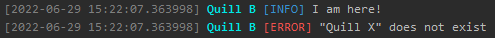

# Quick-Quotes Quill

Logger package.

## Features

Create your own implementations of `QuillBase`.
Manage all your quills with `QuillManagerBase`.
This package has some implementations: `ConsoleQuill`, `SpreadQuillManager` and `AccessQuillManager`.

## Usage

You can use 1-2 loggers for a small project.
Create new quill as a top-level variable.

```dart
import 'package:quick_quotes_quill/console_quill.dart';

final quill = ConsoleQuill('App');
```

QuillBase has 3 functions: log, error,  message.

```dart
void main() {
  divide(10, 5);
}

double divide(int a, int b) {
  if (b == 0) {
    quill.error('$b can not be 0');
    throw Exception('Zero division');
  }

  quill.info('b != 0');

  final r = a / b;
  quill.log('$a / $b = $r');

  return r;
}

```


If you have multiple quills, then you can manage them with `SpreadQuillManager` 
or create your own implementation of `QuillManagerBase`.

```dart
import 'package:quick_quotes_quill/console_quill.dart';
import 'package:quick_quotes_quill/spread_quill_manager.dart';

void main() {
  SpreadQuillManager.inst.initialize([
    ConsoleQuill('Quill A'),
    ConsoleQuill('Quill B'),
  ]);

  SpreadQuillManager.inst
    ..info('There are 2 quills')
    ..log('Nothing interesting')
    ..error('Something is wrong...');
}
```



Also you can use `AccessQuillManager` to access certain quill.

```dart
import 'package:quick_quotes_quill/access_quill_manager.dart';
import 'package:quick_quotes_quill/console_quill.dart';

void main() {
  AccessQuillManager.inst.initialize([
    ConsoleQuill('Quill A'),
    ConsoleQuill('Quill B'),
  ]);

  AccessQuillManager.inst.quill('Quill B').info('I am here!');
  try {
    AccessQuillManager.inst.quill('Quill X').info('I do not exist');
  } catch (e) {
    // ignore: avoid_print
    print(e);
  }
}

```



You can customize ConsoleQuill

```dart
import 'package:quick_quotes_quill/console_quill.dart';

final quill = ConsoleQuill('Quill A');

void main() {
  quill
    ..info('Old style')
    ..config = quill.config.copyWith(
      nameColor: CQColors.lightMagenta,
      msgColor: CQColors.lightBlue,
      tagStyle: CQStyles.underlineOn,
    )
    ..info('New style');
}
```

